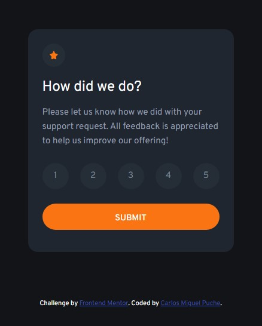
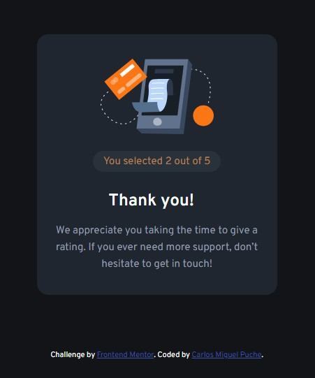

# Interactive Rating Component: UI & Logic Exercise

This project is a **historical practice** focused on the first steps of DOM manipulation and state management with Vanilla JavaScript. I preserve it in my portfolio as evidence of my transition from static layouts to interactive user interfaces.

---

## 🚀 Demo
[SEE DEMO HERE](https://cmp2007.github.io/interactive-rating-component/)

### Screenshots

        

---

## 📋 Evolution & Context Note
> ⚠️ **Note on my trajectory:** This repository reflects my early logic for handling user events. While the current implementation uses manual class toggling and `mousedown` events, it represents the foundation of my understanding of the **Model-View-Controller** flow before migrating to modern frameworks like React. I keep the code in its original state to document my growth in logical problem-solving.

## 📋 Technical Milestones of this Stage
In this specific phase of my training, I successfully achieved:

* **Experimental State Logic:** Implementation of a unique selection system using **array queues (`push` and `shift`)** to ensure only one rating is active. This reflects my early exploration of data structures applied to UI behavior.
* **DOM Manipulation:** Dynamic synchronization between the rating card and the "Thank You" state, injecting the user's score into the final view.
* **BEM-like Architecture:** Early adoption of organized CSS naming conventions (e.g., `RatingState_h3`, `ThankYou_p`) to maintain a scalable and readable style sheet.
* **Interactive UX:** Development of hover states and active button feedback to guide the user through the rating process, including basic validation to prevent empty submissions.

## 🛠️ Technologies (at the time)
* **HTML5:** Semantic structure for accessible components.
* **CSS3:** Flexbox and Grid for centering and layout transitions.
* **Vanilla JavaScript:** Event listeners, array methods (`shift`, `push`), and class manipulation.

---
**Coded by [Carlos Miguel Puche](https://github.com/CMP2007)**
