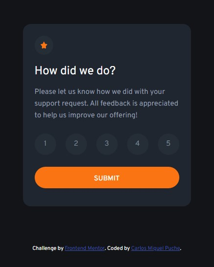
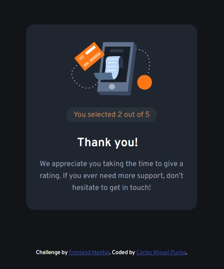

# Frontend Mentor - Interactive rating component solution

This is a solution to the [Interactive rating component challenge on Frontend Mentor](https://www.frontendmentor.io/challenges/interactive-rating-component-koxpeBUmI).

## Table of contents

- [Overview](#overview)
  - [The challenge](#the-challenge)
  - [Screenshot](#screenshot)
  - [Links](#links)
- [My process](#my-process)
  - [Built with](#built-with)
  - [What I learned](#what-i-learned)
  - [Continued development](#continued-development)
- [Author](#author)
- [Acknowledgments](#acknowledgments)

## Overview

### The challenge

Users should be able to:

- View the optimal layout for the app depending on their device's screen size
- See hover states for all interactive elements on the page
- Select and submit a number rating
- See the "Thank you" card state after submitting a rating

### Screenshot

        

### Links

- Solution URL: [Add solution URL here](https://github.com/CMP2007/interactive-rating-component)
- Live Site URL: [Add live site URL here](https://cmp2007.github.io/interactive-rating-component/)

## My process

### Built with

- Semantic HTML5 markup
- CSS custom properties
- Flexbox
- CSS Grid
- Mobile-first workflow

### Continued development

At this time I want to continue doing challenges and practices based on HTML, CSS and JS to develop a good foundation before continuing with my learning path

## Author

### Carlos Miguel Puche Moreno

- Frontend Mentor - [CMP2007](https://www.frontendmentor.io/profile/CMP2007)
